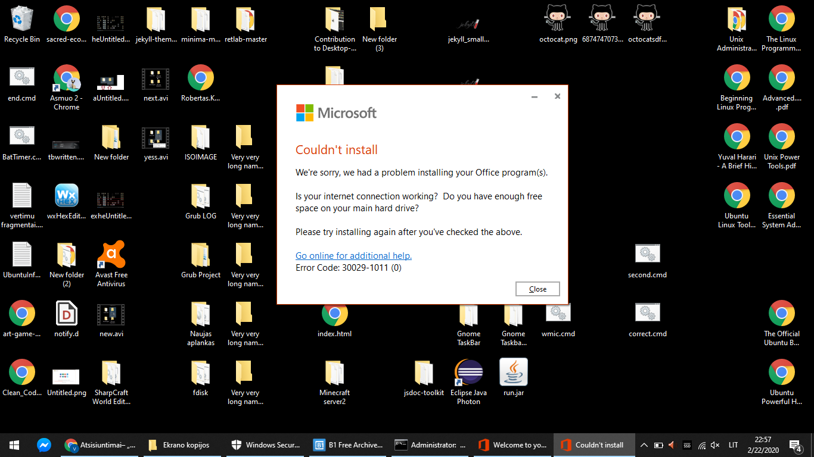

### Licenses can be found in 
```
C:\Program Files\Microsoft Office\root\Licenses16
```


Source: https://forums.mydigitallife.net/threads/office-2016-vl-to-retail.65654/

### Licenses can be installed this way
```
cleanospp.exe

for /f "delims=" %i in ('dir /b /on *.xrm-ms') do (cscript //Nologo %windir%\System32\slmgr.vbs /ilc %i)
```


### OSPP activation status can be found here
```
cscript "C:\Program Files\Microsoft Office\Office16\OSPP.VBS" /dstatus"
```

### OSPP rearm is executed this way
```
cscript "C:\Program Files\Microsoft Office\Office16\OSPP.VBS" /rearm"
```


### Licenses installed after web-install
```

                          ==============================
                         *** Check installed licenses ***
                          ==============================

Office16ProPlusR_OEM_Perp3
Office16ProPlusR_OEM_Perp5
Office16ProPlusR_OEM_Perp4
Office16ProPlusR_OEM_Perp2
Office16ProPlusDemoR_BypassTrial180
Office16ProPlusR_OEM_Perp
Office16ProPlusR_Grace
Office16ProPlusMSDNR_Retail
Office16ProPlusR_OEM_Perp6
Office16ProPlusR_Trial
Office16ProPlusR_Retail
Office16ProPlusR_Trial2
```


## Installing Language accessory pack

### The cause of this error is still unsure, but happens after conversion from WEB-Installed Office (Retail) to Volume

* If you get this error, you have to reinstall Microsoft Office 2016 and only then you will be allowed to install Display language pack 
* If you want to Install Display language packs, you gotta install them before conversion from Retail license to Volume license  

Language accessory pack download link: https://support.office.com/en-us/article/language-accessory-pack-for-office-82ee1236-0f9a-45ee-9c72-05b026ee809f

### Screenshot showing the breakpoint for causality of Language accessory pack error

